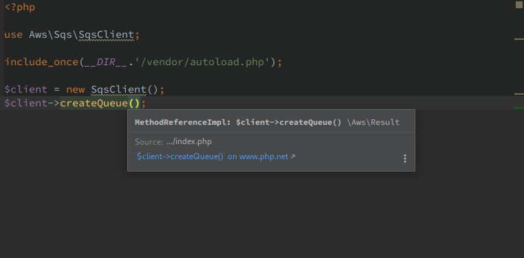
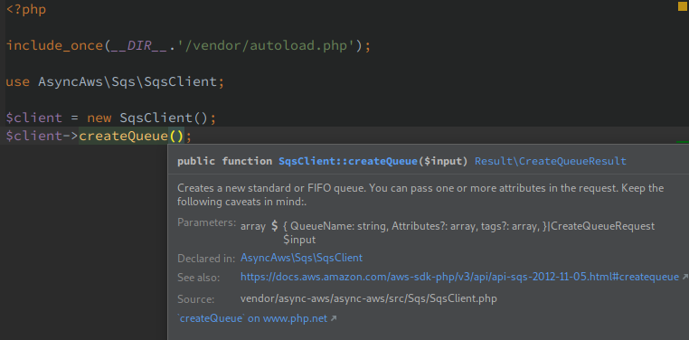
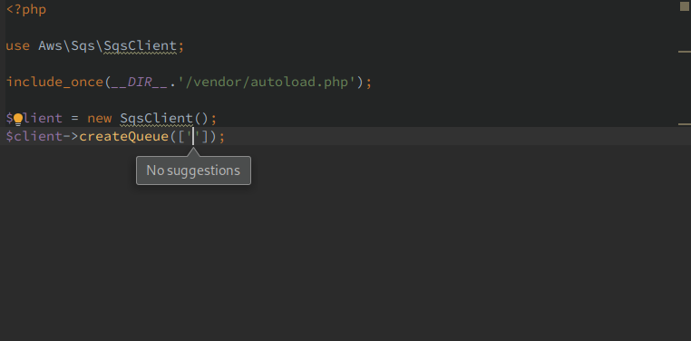
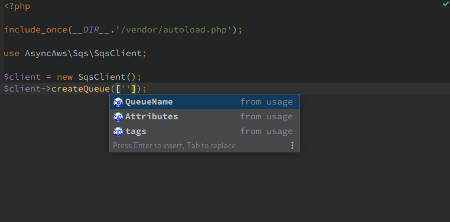
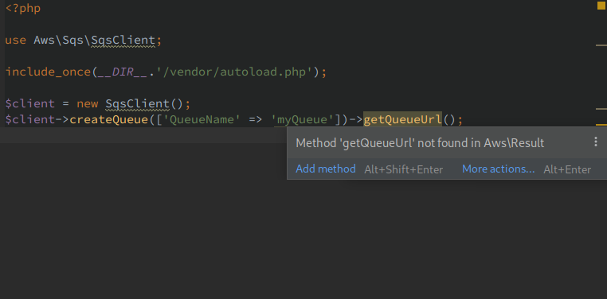
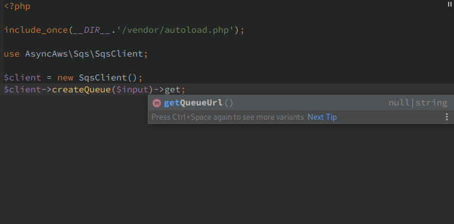

# Compare Async-Aws vs AWS PHP SDK

|   | AWS PHP SDK | Async-Aws |
|---|-------------|-----------|
| [Async](#async-experience)                    | | :heavy_check_mark: |
| [Pagination](#pagination-experience)          | | :heavy_check_mark: |
| [Weight](#dependencies-size)                  | | :heavy_check_mark: |
| [Developer Experience](#developer-experience) | | :heavy_check_mark: |
| [Mock / Proxy](#mock-and-proxy)               | | :heavy_check_mark: |
| [Features Coverage](#features-coverage)       | :heavy_check_mark: | |

## Async eXperience

By default, all calls are async. Thanks to the power of the
[Symfony HTTP client](https://symfony.com/doc/current/components/http_client.html)
the process is not blocking until you need to read the result.

**Async-Aws:**
```php
$files = [];
foreach (range(0, 10) as $index) {
    $files[] = $s3Client->putObject(['Bucket' => 'my.bucket', 'Key' => 'file-' . uniqid('file-', true), 'Body' => 'test']);
}
// at this point, calls to putObjects are not yet resolved
foreach ($files as $file) {
    // calling $file->getKey() will wait the response from AWS and returned the real value
    $s3Client->deleteObject(['Bucket' => 'my.bucket', 'Key' => $file->getKey()]);
}
// no need to wait ends of deleteObject. It will be automatically resolved on destruct
```

**Official AWS PHP SDK:**
```php
use GuzzleHttp\Promise;

$promises = [];
foreach (range(0, 10) as $index) {
    $promises[] = $s3Client->putObjectAsync(['Bucket' => 'my.bucket', 'Key' => 'file-' . uniqid('file-', true), 'Body' => 'test']);
}

$deletePromises = [];
foreach ($promises as $promise) {
    $file = $promise->wait();
    // calling $file->getKey() will wait the response from AWS and returned the real value
    $deletePromises[] = $s3Client->deleteObjectAsync(['Bucket' => 'my.bucket', 'Key' => $file['Key']]);
}
Promise\all($deletePromises)->wait();
```

## Pagination eXperience

Async-Aws handled, by default, the complexity of paginated results. You don't
have to worry about `IsTruncated` or `NextMarker` or calling magic methods, just
iterates over results, Async-Aws do the rest.

**Async-Aws:**
```php
$objects = $s3Client->listObjectsV2(['Bucket' => 'my.bucket']);
foreach ($objects as $object) {
    //
}
```

**Official AWS PHP SDK:**
```php
$nextToken = null;
do {
    $objects = $s3Client->ListObjectsV2(['Bucket' => 'my-bucket', 'NextContinuationToken' => $nextToken]);
    foreach ($objects['Contents'] as $object) {
        //
    }
    foreach ($objects['CommonPrefixes'] as $object) {
        //
    }
    $nextToken = $objects['ContinuationToken'];
} while ($nextToken !== null);

// or with paginator

$pages = $s3Client->getPaginator('ListObjectsV2', ['Bucket' => 'my.bucket']);
foreach ($pages as $page) {
    foreach ($page['Contents'] as $object) {
        //
    }
    foreach ($page['CommonPrefixes'] as $object) {
        //
    }
}

```

*note*: Even if pagination is automatically handled, Async-Aws let you fetch
only result for the current page.

## Developer eXperience

Ever get the error `PHP Fatal error: Missing required client configuration
options: version: (string)` in official AWS PHP SDK, and dig into documentation
to blindly copy/paste `['version' => '2006-03-01']`? Async-Aws saved you from
this complexity and use the right version for you.

Async-Aws also provides real classes with documented getter and methods, while
 the
official AWS PHP SDK uses magic methods and undocumented array accessor.

| AWS PHP SDK | Async-Aws |
|-------------|-----------|
|  |  |
|    |    |
|  |  |

## Dependencies size

By providing isolated package for each service, Async Aws is ultra thin. For
instance `async-php/s3` + `async-php/core` weighs **0.6Mib**, while official AWS
PHP SDK uses **22MiB** regardless of the number of services you use.

## Mock and Proxy

Because Async-Aws uses real classes, it's easy to Mock them in PHPUnit tests or
while the official AWS PHP SDK uses the `__call` magic methods which increase
complexity and reduce the developer experience.

## Features coverage

While Async-Aws focused on the most used operations (4 services and 19 methods),
The official AWS PHP SDK covers the full scope of AWS (200 services and 8,000
methods).
